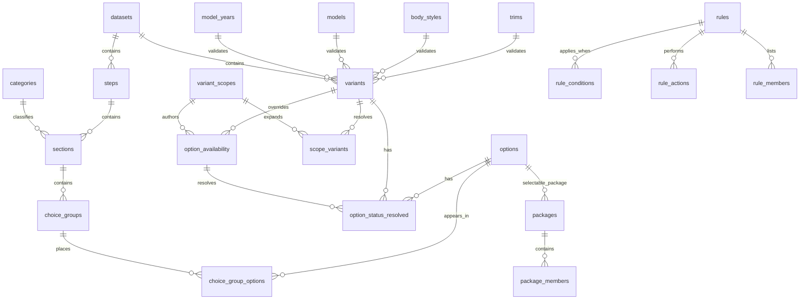

# schemaData

CSV and SQL scaffold for the hard schema plan in `hardSchemaPlan.md`.

This folder is a shadow schema scaffold. It does not migrate production data, modify runtime behavior, or create workbook/generator coupling. Production behavior remains the oracle until a separate cutover is explicitly approved.

## Design Contract

- Author broadly, resolve concretely.
- `variants + option_status_resolved + options` is the resolved availability spine.
- `option_availability` is the editable scope-aware authoring table.
- Missing resolved availability means unavailable by default.
- `choice_group_options` is global placement; app rendering must use resolved app-facing views.
- `standard_equipment` is not an editable source table. Standard equipment is derived into `app_standard_equipment`.
- Rules use typed condition/action references instead of editable polymorphic `source_type/source_id` and `target_type/target_id`.
- Source rows are staging evidence only. The app must not consume `source_rows`.

## Folder Map

```text
schemaData/
├── app/
│   ├── app_packages_resolved.csv
│   ├── app_rules_resolved.csv
│   ├── app_standard_equipment.csv
│   ├── app_ui_render.csv
│   └── app_variants.csv
├── core/
│   ├── option_versions.csv
│   ├── options.csv
│   ├── scope_variants.csv
│   ├── variant_scopes.csv
│   └── variants.csv
├── logic/
│   ├── rule_actions.csv
│   ├── rule_conditions.csv
│   ├── rule_members.csv
│   └── rules.csv
├── lookup/
│   ├── body_styles.csv
│   ├── categories.csv
│   ├── datasets.csv
│   ├── model_years.csv
│   ├── models.csv
│   └── trims.csv
├── packages/
│   ├── package_members.csv
│   ├── package_validation.csv
│   └── packages.csv
├── presentation/
│   ├── choice_group_options.csv
│   ├── choice_groups.csv
│   ├── sections.csv
│   └── steps.csv
├── releases/
│   └── _releases.csv
├── source/
│   └── source_rows.csv
├── sql/
│   ├── 001_create_schema.sql
│   └── 001_rollback_schema.sql
├── state/
│   ├── option_availability.csv
│   └── option_status_resolved.csv
└── validation/
    ├── _integrity.csv
    ├── _manifest.csv
    ├── _validation_lists.csv
    └── variant_group_validation.csv
```

## Stable Spine

```text
dataset_id ─ dataset namespace
variant_id ─ concrete build context
scope_id   ─ broad authoring context
option_id  ─ canonical option key
group_id   ─ display/choice grouping key
rule_id    ─ dependency/pricing rule key
package_id ─ package/bundle key
release_id ─ published data snapshot key
```



## CSV Headers

| Folder | File | Header |
| --- | --- | --- |
| `lookup` | `datasets.csv` | `dataset_id,dataset_name,model_family,schema_version,active` |
| `lookup` | `model_years.csv` | `model_year,active` |
| `lookup` | `models.csv` | `model_key,model_name,active` |
| `lookup` | `body_styles.csv` | `body_style,body_style_label,active` |
| `lookup` | `trims.csv` | `trim_level,trim_label,active` |
| `lookup` | `categories.csv` | `category_id,category_name,display_order,active` |
| `core` | `variants.csv` | `variant_id,dataset_id,model_year,model_key,body_style,trim_level,display_name,active` |
| `core` | `variant_scopes.csv` | `scope_id,scope_name,dataset_id,year_min,year_max,model_key,body_style,trim_level,active` |
| `core` | `scope_variants.csv` | `scope_variant_key,scope_id,variant_id` |
| `core` | `options.csv` | `option_id,rpo_code,option_label,option_description,option_type,option_family,active` |
| `core` | `option_versions.csv` | `option_version_id,option_id,rpo_code,model_year,model_key,option_label,option_description,active` |
| `presentation` | `steps.csv` | `step_id,dataset_id,step_key,step_label,display_order,active` |
| `presentation` | `sections.csv` | `section_id,step_id,category_id,section_label,display_order,active` |
| `presentation` | `choice_groups.csv` | `group_id,section_id,group_label,selection_mode,required,min_select,max_select,display_order,active` |
| `presentation` | `choice_group_options.csv` | `group_option_key,group_id,option_id,display_order,active` |
| `state` | `option_availability.csv` | `availability_id,scope_id,variant_id,option_id,status,base_price,default_flag,locked_flag,notes,active` |
| `state` | `option_status_resolved.csv` | `variant_option_key,variant_id,option_id,resolved_status,resolved_price,default_flag,locked_flag,source_availability_id,active` |
| `logic` | `rules.csv` | `rule_id,rule_name,rule_type,scope_id,variant_id,priority,message,active` |
| `logic` | `rule_conditions.csv` | `rule_condition_id,rule_id,condition_group,condition_order,source_option_id,source_group_id,source_variant_id,operator,expected_value,active` |
| `logic` | `rule_actions.csv` | `rule_action_id,rule_id,action_type,target_option_id,target_group_id,target_variant_id,price_mode,rule_action_value,currency,active` |
| `logic` | `rule_members.csv` | `rule_member_id,rule_id,member_option_id,member_group_id,display_order,active` |
| `packages` | `packages.csv` | `package_id,package_option_id,package_label,active` |
| `packages` | `package_members.csv` | `package_member_id,package_id,member_option_id,member_status,member_price_mode,member_price_value,required,locked,active` |
| `packages` | `package_validation.csv` | `package_validation_id,package_id,variant_id,validation_status,message,active` |
| `source` | `source_rows.csv` | `source_row_id,dataset_id,variant_id,raw_section,raw_rpo,raw_label,raw_description,raw_status,raw_price,raw_notes,row_hash,classification,active` |
| `app` | `app_variants.csv` | `variant_id,display_name,model_year,model_key,body_style,trim_level,active` |
| `app` | `app_ui_render.csv` | `dataset_id,variant_id,step_id,step_label,step_order,section_id,section_label,section_order,group_id,group_label,group_order,selection_mode,required,min_select,max_select,option_id,rpo_code,option_label,option_description,status,price,default_flag,locked_flag,display_order` |
| `app` | `app_standard_equipment.csv` | `variant_id,option_id,rpo_code,label,description,status,notes` |
| `app` | `app_rules_resolved.csv` | `rule_id,variant_id,rule_type,priority,source_type,source_id,target_type,target_id,action_type,price_mode,rule_action_value,message` |
| `app` | `app_packages_resolved.csv` | `variant_id,package_option_id,member_option_id,member_status,member_price_mode,member_price_value,required,locked` |
| `validation` | `_manifest.csv` | `sheet_name,primary_key_column,named_range,description,source_type,editable,published` |
| `validation` | `_integrity.csv` | `check_id,check_name,severity,error_count,publish_blocker,notes` |
| `validation` | `_validation_lists.csv` | `list_name,value,display_order,active` |
| `validation` | `variant_group_validation.csv` | `variant_id,group_id,available_option_count,default_option_count,standard_fixed_count,required,selection_mode,validation_status` |
| `releases` | `_releases.csv` | `release_id,schema_version,data_version,status,created_at,published_at,published_by,checksum,rollback_to_release_id,notes` |

## Authoring Tables

Lookup tables normalize variant context and presentation categories:

```text
datasets
model_years
models
body_styles
trims
categories
```

Canonical editable tables:

```text
variants
variant_scopes
options
option_versions
steps
sections
choice_groups
choice_group_options
option_availability
rules
rule_conditions
rule_actions
rule_members
packages
package_members
source_rows
```

`scope_variants`, `option_status_resolved`, app tables, package validation, and validation tables are generated or publish-time outputs unless a later workflow explicitly marks them editable.

## Availability Resolution

Use `option_availability` for human authoring:

- `scope_id` means broad availability.
- `variant_id` means exact variant override.
- Populate exactly one of `scope_id` or `variant_id`.
- Exact `variant_id` overrides win over broad `scope_id` rows.
- `status = optional` requires a concrete price; a free option uses `0`, not blank.

Generate `option_status_resolved` as concrete `variant_id + option_id` rows:

```text
variant_option_key = variant_id + "|" + option_id
```

The configurator should treat any missing `variant_id + option_id` row as unavailable.

## Presentation Resolution

Presentation stays normalized:

```text
steps -> sections -> choice_groups -> choice_group_options -> options
```

Do not render `choice_group_options` directly. The app-facing `app_ui_render` view joins presentation placement to `option_status_resolved` and filters inactive or unavailable rows.

`choice_groups` intentionally does not duplicate:

```text
section_name
category_id
category_name
step_key
```

Resolve those display fields through joins.

## Rules

Rules are split into metadata, conditions, actions, and optional member lists:

```text
rules
rule_conditions
rule_actions
rule_members
```

Typed reference columns replace editable polymorphic ID pairs. Generated app views may emit `source_type/source_id` and `target_type/target_id`, but those are derived for app consumption.

Pricing rules must use structured fields:

```text
priority
price_mode
rule_action_value
currency
```

Do not store price logic only in `message`.

## Packages

Packages are modeled as selectable options where `options.option_type = package`, then expanded through:

```text
packages
package_members
app_packages_resolved
```

Package members should resolve to concrete variant-level effects before publishing.

## App-Facing Views

The app should consume only resolved, published views:

```text
app_variants
app_ui_render
app_standard_equipment
app_rules_resolved
app_packages_resolved
```

Editable authoring CSVs are not the runtime contract.

## Validation And Publishing

Use validation files to mirror the workbook hardening plan:

```text
_manifest
_integrity
_validation_lists
variant_group_validation
```

Publishing should be blocked when critical integrity counts are non-zero.

Use `_releases` for draft, validated, published, archived, and rolled-back data snapshots. The app should consume only the latest published release, and cache invalidation should key off `release_id`.

## SQL

Create the schema:

```sql
\i schemaData/sql/001_create_schema.sql
```

Rollback the scaffold:

```sql
\i schemaData/sql/001_rollback_schema.sql
```

Suggested load order for authoring CSVs:

1. `lookup/datasets.csv`
2. `lookup/model_years.csv`
3. `lookup/models.csv`
4. `lookup/body_styles.csv`
5. `lookup/trims.csv`
6. `lookup/categories.csv`
7. `core/variants.csv`
8. `core/variant_scopes.csv`
9. `core/scope_variants.csv`
10. `core/options.csv`
11. `core/option_versions.csv`
12. `presentation/steps.csv`
13. `presentation/sections.csv`
14. `presentation/choice_groups.csv`
15. `presentation/choice_group_options.csv`
16. `state/option_availability.csv`
17. `state/option_status_resolved.csv`
18. `logic/rules.csv`
19. `logic/rule_conditions.csv`
20. `logic/rule_actions.csv`
21. `logic/rule_members.csv`
22. `packages/packages.csv`
23. `packages/package_members.csv`
24. `source/source_rows.csv`

App, validation, package-validation, and release CSVs are generated or operational outputs unless a later workflow explicitly says otherwise.
