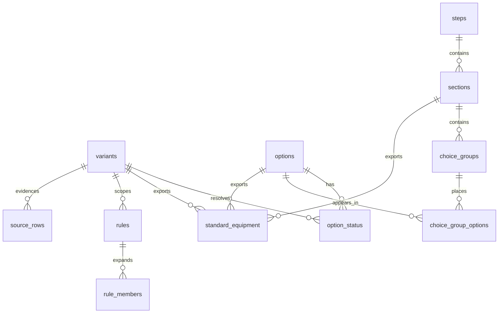
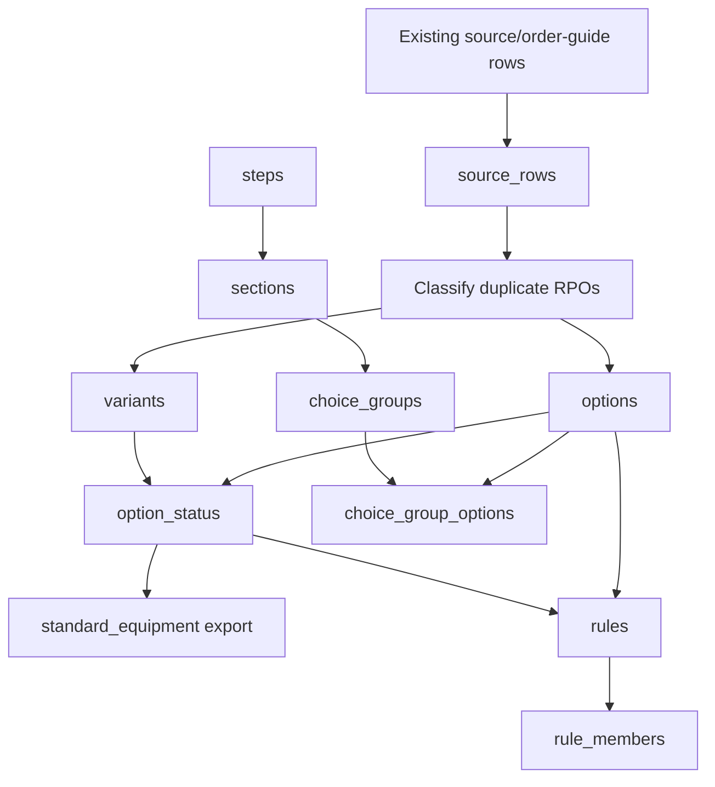

# schemaData

Base CSV and SQL structure for the single-spine schema described in `newSchemaFinal.md`.

This folder is a shadow schema scaffold. It does not migrate production data, modify runtime behavior, or create workbook/generator coupling.

## Folder Map

```text
schemaData/
├── core/
│   ├── variants.csv
│   └── options.csv
├── presentation/
│   ├── steps.csv
│   ├── sections.csv
│   ├── choice_groups.csv
│   └── choice_group_options.csv
├── state/
│   ├── option_status.csv
│   └── standard_equipment.csv
├── logic/
│   ├── rules.csv
│   └── rule_members.csv
├── source/
│   └── source_rows.csv
└── sql/
    ├── 001_create_schema.sql
    └── 001_rollback_schema.sql
```

## Stable Spine

```text
variant_id ─ build context
option_id  ─ real option key
group_id   ─ display/choice grouping key
rule_id    ─ conditional logic key
```



## CSV Headers

| Folder         | File                       | Header                                                                                                                                 |
| -------------- | -------------------------- | -------------------------------------------------------------------------------------------------------------------------------------- |
| `core`         | `variants.csv`             | `variant_id,model_year,model_key,body_style,trim_level,active`                                                                         |
| `core`         | `options.csv`              | `option_id,rpo,label,description,option_type,active`                                                                                   |
| `presentation` | `steps.csv`                | `step_key,dataset_id,step_label,display_order,active`                                                                                  |
| `presentation` | `sections.csv`             | `section_id,dataset_id,step_key,section_name,category_id,category_name,display_order,active`                                           |
| `presentation` | `choice_groups.csv`        | `group_id,label,section_id,section_name,category_id,category_name,step_key,selection_mode,required,active`                             |
| `presentation` | `choice_group_options.csv` | `group_id,option_id,display_order,active`                                                                                              |
| `state`        | `option_status.csv`        | `option_id,variant_id,status,price,active`                                                                                             |
| `state`        | `standard_equipment.csv`   | `standard_equipment_id,dataset_id,variant_id,option_id,section_id,display_order,label_override,description_override,notes,active`      |
| `logic`        | `rules.csv`                | `rule_id,rule_type,source_type,source_id,target_type,target_id,variant_id,message,active`                                              |
| `logic`        | `rule_members.csv`         | `rule_id,member_type,member_id,member_order,active`                                                                                    |
| `source`       | `source_rows.csv`          | `source_row_id,variant_id,raw_section,raw_rpo,raw_label,raw_description,raw_status,raw_price,raw_notes,row_hash,classification,active` |

## Table Definitions

### `variants`

| Column       |      Type | Constraints           | Notes                     |
| ------------ | --------: | --------------------- | ------------------------- |
| `variant_id` |    `text` | PK                    | Stable build context key. |
| `model_year` | `integer` | NOT NULL              | Query/display helper.     |
| `model_key`  |    `text` | NOT NULL              | Query/display helper.     |
| `body_style` |    `text` | NOT NULL              | Query/display helper.     |
| `trim_level` |    `text` | NOT NULL              | Query/display helper.     |
| `active`     | `boolean` | NOT NULL DEFAULT true | Soft activation.          |

```sql
CREATE TABLE variants (
  variant_id text PRIMARY KEY,
  model_year integer NOT NULL,
  model_key text NOT NULL,
  body_style text NOT NULL,
  trim_level text NOT NULL,
  active boolean NOT NULL DEFAULT true
);
```

### `options`

| Column        |      Type | Constraints           | Notes                                       |
| ------------- | --------: | --------------------- | ------------------------------------------- |
| `option_id`   |    `text` | PK                    | Canonical option key.                       |
| `rpo`         |    `text` | NOT NULL              | RPO property, not the key.                  |
| `label`       |    `text` | NOT NULL              | Customer facing label.                      |
| `description` |    `text` | nullable              | Optional descriptive copy.                  |
| `option_type` |    `text` | NOT NULL              | Value set is not fully specified in source. |
| `active`      | `boolean` | NOT NULL DEFAULT true | Soft activation.                            |

```sql
CREATE TABLE options (
  option_id text PRIMARY KEY,
  rpo text NOT NULL,
  label text NOT NULL,
  description text,
  option_type text NOT NULL,
  active boolean NOT NULL DEFAULT true
);
```

### `steps`

| Column          |      Type | Constraints           | Notes                             |
| --------------- | --------: | --------------------- | --------------------------------- |
| `step_key`      |    `text` | PK part               | Step identifier inside a dataset. |
| `dataset_id`    |    `text` | PK part               | Dataset namespace.                |
| `step_label`    |    `text` | NOT NULL              | Display label.                    |
| `display_order` | `integer` | NOT NULL              | Sort order.                       |
| `active`        | `boolean` | NOT NULL DEFAULT true | Soft activation.                  |

```sql
CREATE TABLE steps (
  step_key text NOT NULL,
  dataset_id text NOT NULL,
  step_label text NOT NULL,
  display_order integer NOT NULL,
  active boolean NOT NULL DEFAULT true,
  PRIMARY KEY (dataset_id, step_key)
);
```

### `sections`

| Column          |      Type | Constraints              | Notes              |
| --------------- | --------: | ------------------------ | ------------------ |
| `section_id`    |    `text` | PK                       | Section key.       |
| `dataset_id`    |    `text` | FK to `steps.dataset_id` | Dataset namespace. |
| `step_key`      |    `text` | FK to `steps.step_key`   | Parent step.       |
| `section_name`  |    `text` | NOT NULL                 | Display name.      |
| `category_id`   |    `text` | NOT NULL                 | Category key.      |
| `category_name` |    `text` | NOT NULL                 | Category label.    |
| `display_order` | `integer` | NOT NULL                 | Sort order.        |
| `active`        | `boolean` | NOT NULL DEFAULT true    | Soft activation.   |

```sql
CREATE TABLE sections (
  section_id text PRIMARY KEY,
  dataset_id text NOT NULL,
  step_key text NOT NULL,
  section_name text NOT NULL,
  category_id text NOT NULL,
  category_name text NOT NULL,
  display_order integer NOT NULL,
  active boolean NOT NULL DEFAULT true,
  FOREIGN KEY (dataset_id, step_key) REFERENCES steps (dataset_id, step_key)
);
```

### `choice_groups`

| Column           |      Type | Constraints                 | Notes                                                  |
| ---------------- | --------: | --------------------------- | ------------------------------------------------------ |
| `group_id`       |    `text` | PK                          | Stable choice group key.                               |
| `label`          |    `text` | NOT NULL                    | Group display label.                                   |
| `section_id`     |    `text` | FK to `sections.section_id` | Parent section.                                        |
| `section_name`   |    `text` | NOT NULL                    | Denormalized display helper from source header.        |
| `category_id`    |    `text` | NOT NULL                    | Denormalized display helper from source header.        |
| `category_name`  |    `text` | NOT NULL                    | Denormalized display helper from source header.        |
| `step_key`       |    `text` | NOT NULL                    | Denormalized display helper from source header.        |
| `selection_mode` |    `text` | CHECK                       | `single`, `single_select_req`, or `single_select_opt`. |
| `required`       | `boolean` | NOT NULL                    | Required behavior remains semantically open in source. |
| `active`         | `boolean` | NOT NULL DEFAULT true       | Soft activation.                                       |

```sql
CREATE TABLE choice_groups (
  group_id text PRIMARY KEY,
  label text NOT NULL,
  section_id text NOT NULL REFERENCES sections (section_id),
  section_name text NOT NULL,
  category_id text NOT NULL,
  category_name text NOT NULL,
  step_key text NOT NULL,
  selection_mode text NOT NULL CHECK (selection_mode IN ('single', 'single_select_req', 'single_select_opt')),
  required boolean NOT NULL,
  active boolean NOT NULL DEFAULT true
);
```

### `choice_group_options`

| Column          |      Type | Constraints           | Notes                    |
| --------------- | --------: | --------------------- | ------------------------ |
| `group_id`      |    `text` | PK part, FK           | Choice group.            |
| `option_id`     |    `text` | PK part, FK           | Universal option.        |
| `display_order` | `integer` | NOT NULL              | Sort order within group. |
| `active`        | `boolean` | NOT NULL DEFAULT true | Soft activation.         |

```sql
CREATE TABLE choice_group_options (
  group_id text NOT NULL REFERENCES choice_groups (group_id),
  option_id text NOT NULL REFERENCES options (option_id),
  display_order integer NOT NULL,
  active boolean NOT NULL DEFAULT true,
  PRIMARY KEY (group_id, option_id)
);
```

### `option_status`

| Column       |            Type | Constraints           | Notes                                                                       |
| ------------ | --------------: | --------------------- | --------------------------------------------------------------------------- |
| `option_id`  |          `text` | PK part, FK           | Universal option.                                                           |
| `variant_id` |          `text` | PK part, FK           | Resolved variant context.                                                   |
| `status`     |          `text` | CHECK                 | `optional`, `standard_choice`, `standard_fixed`, `included`, `unavailable`. |
| `price`      | `numeric(12,2)` | NOT NULL DEFAULT 0    | Base variant price before rule overrides.                                   |
| `active`     |       `boolean` | NOT NULL DEFAULT true | Soft activation.                                                            |

```sql
CREATE TABLE option_status (
  option_id text NOT NULL REFERENCES options (option_id),
  variant_id text NOT NULL REFERENCES variants (variant_id),
  status text NOT NULL CHECK (status IN ('optional', 'standard_choice', 'standard_fixed', 'included', 'unavailable')),
  price numeric(12, 2) NOT NULL DEFAULT 0,
  active boolean NOT NULL DEFAULT true,
  PRIMARY KEY (option_id, variant_id)
);
```

### `standard_equipment`

| Column                  |      Type | Constraints                                          | Notes                     |
| ----------------------- | --------: | ---------------------------------------------------- | ------------------------- |
| `standard_equipment_id` |    `text` | PK                                                   | Export row key.           |
| `dataset_id`            |    `text` | NOT NULL                                             | Dataset namespace.        |
| `variant_id`            |    `text` | FK to `variants` and composite FK to `option_status` | Variant context.          |
| `option_id`             |    `text` | FK to `options` and composite FK to `option_status`  | Same canonical option_id. |
| `section_id`            |    `text` | FK                                                   | Display section.          |
| `display_order`         | `integer` | NOT NULL                                             | Export sort order.        |
| `label_override`        |    `text` | nullable                                             | Export override only.     |
| `description_override`  |    `text` | nullable                                             | Export override only.     |
| `notes`                 |    `text` | nullable                                             | Export notes.             |
| `active`                | `boolean` | NOT NULL DEFAULT true                                | Soft activation.          |

```sql
CREATE TABLE standard_equipment (
  standard_equipment_id text PRIMARY KEY,
  dataset_id text NOT NULL,
  variant_id text NOT NULL REFERENCES variants (variant_id),
  option_id text NOT NULL REFERENCES options (option_id),
  section_id text NOT NULL REFERENCES sections (section_id),
  display_order integer NOT NULL,
  label_override text,
  description_override text,
  notes text,
  active boolean NOT NULL DEFAULT true,
  FOREIGN KEY (option_id, variant_id) REFERENCES option_status (option_id, variant_id)
);
```

### `rules`

| Column        |      Type | Constraints           | Notes                                                                                     |
| ------------- | --------: | --------------------- | ----------------------------------------------------------------------------------------- |
| `rule_id`     |    `text` | PK                    | Stable rule key.                                                                          |
| `rule_type`   |    `text` | CHECK                 | `excludes`, `requires`, `includes`, `requires_any`, `price_override`, `replaces_default`. |
| `source_type` |    `text` | CHECK                 | `option`, `group`, or `variant`.                                                          |
| `source_id`   |    `text` | NOT NULL              | Polymorphic reference.                                                                    |
| `target_type` |    `text` | CHECK                 | `option`, `group`, or `variant`.                                                          |
| `target_id`   |    `text` | NOT NULL              | Polymorphic reference.                                                                    |
| `variant_id`  |    `text` | FK nullable           | Null means wherever source and target exist.                                              |
| `message`     |    `text` | nullable              | User/admin explanation.                                                                   |
| `active`      | `boolean` | NOT NULL DEFAULT true | Soft activation.                                                                          |

```sql
CREATE TABLE rules (
  rule_id text PRIMARY KEY,
  rule_type text NOT NULL CHECK (rule_type IN ('excludes', 'requires', 'includes', 'requires_any', 'price_override', 'replaces_default')),
  source_type text NOT NULL CHECK (source_type IN ('option', 'group', 'variant')),
  source_id text NOT NULL,
  target_type text NOT NULL CHECK (target_type IN ('option', 'group', 'variant')),
  target_id text NOT NULL,
  variant_id text REFERENCES variants (variant_id),
  message text,
  active boolean NOT NULL DEFAULT true
);
```

### `rule_members`

| Column         |      Type | Constraints           | Notes                            |
| -------------- | --------: | --------------------- | -------------------------------- |
| `rule_id`      |    `text` | PK part, FK           | Parent rule.                     |
| `member_type`  |    `text` | PK part, CHECK        | `option`, `group`, or `variant`. |
| `member_id`    |    `text` | PK part               | Polymorphic member reference.    |
| `member_order` | `integer` | NOT NULL              | Member ordering.                 |
| `active`       | `boolean` | NOT NULL DEFAULT true | Soft activation.                 |

```sql
CREATE TABLE rule_members (
  rule_id text NOT NULL REFERENCES rules (rule_id),
  member_type text NOT NULL CHECK (member_type IN ('option', 'group', 'variant')),
  member_id text NOT NULL,
  member_order integer NOT NULL,
  active boolean NOT NULL DEFAULT true,
  PRIMARY KEY (rule_id, member_type, member_id)
);
```

### `source_rows`

| Column            |      Type | Constraints           | Notes                                |
| ----------------- | --------: | --------------------- | ------------------------------------ |
| `source_row_id`   |    `text` | PK                    | Raw evidence row key.                |
| `variant_id`      |    `text` | FK nullable           | Variant if resolved at staging time. |
| `raw_section`     |    `text` | nullable              | Raw source section.                  |
| `raw_rpo`         |    `text` | nullable              | Raw source RPO.                      |
| `raw_label`       |    `text` | nullable              | Raw label.                           |
| `raw_description` |    `text` | nullable              | Raw description.                     |
| `raw_status`      |    `text` | nullable              | Raw status.                          |
| `raw_price`       |    `text` | nullable              | Raw price kept as text for evidence. |
| `raw_notes`       |    `text` | nullable              | Raw notes/details.                   |
| `row_hash`        |    `text` | NOT NULL              | Staging dedupe/audit hash.           |
| `classification`  |    `text` | nullable              | Importer classification.             |
| `active`          | `boolean` | NOT NULL DEFAULT true | Soft activation.                     |

```sql
CREATE TABLE source_rows (
  source_row_id text PRIMARY KEY,
  variant_id text REFERENCES variants (variant_id),
  raw_section text,
  raw_rpo text,
  raw_label text,
  raw_description text,
  raw_status text,
  raw_price text,
  raw_notes text,
  row_hash text NOT NULL,
  classification text,
  active boolean NOT NULL DEFAULT true
);
```

## Index Plan

| Index                                          | Query Pattern                                                  | Why It Exists                                                                   |
| ---------------------------------------------- | -------------------------------------------------------------- | ------------------------------------------------------------------------------- |
| `idx_variants_active_lookup`                   | Find active variants by `model_key/body_style/trim_level`.     | Variant selection is the entrypoint for resolution.                             |
| `idx_options_rpo`                              | Lookup options from imported RPOs.                             | RPO is not the key, but migration/reconciliation will repeatedly search by RPO. |
| `idx_options_active_type`                      | Filter active options by `option_type`.                        | Supports catalog/admin browsing without scanning inactive rows.                 |
| `idx_steps_dataset_order`                      | Render steps for a dataset.                                    | Keeps UI ordering cheap.                                                        |
| `idx_sections_dataset_step_order`              | Render sections under each step.                               | Matches presentation resolution flow.                                           |
| `idx_choice_groups_section_order`              | Load groups for a section.                                     | Supports section-to-choice rendering.                                           |
| `idx_choice_group_options_option`              | Find every placement for an option.                            | Useful for duplicate RPO audits and migration checks.                           |
| `idx_choice_group_options_group_order`         | Render options within a group.                                 | Core customer-facing read path.                                                 |
| `idx_option_status_variant_status`             | Load all option states for a variant, excluding unavailable.   | This is the main application read path.                                         |
| `idx_option_status_option`                     | Audit every variant status for an option.                      | Supports migration parity and admin review.                                     |
| `idx_standard_equipment_variant_section_order` | Render materialized standard equipment by variant and section. | Export-only read path.                                                          |
| `idx_rules_source`                             | Apply rules triggered by selected/present source.              | Core rule engine lookup.                                                        |
| `idx_rules_target`                             | Audit reverse dependencies and impacts.                        | Supports admin/debug tooling.                                                   |
| `idx_rules_variant_type`                       | Load scoped rules for a variant.                               | Variant-specific rule resolution.                                               |
| `idx_rule_members_rule_order`                  | Resolve `requires_any` member lists.                           | Rule members are authoritative for any-of satisfaction.                         |
| `idx_source_rows_hash`                         | Dedupe raw imports.                                            | Prevents repeated source evidence.                                              |
| `idx_source_rows_variant_rpo`                  | Reconcile raw rows by variant and RPO.                         | Supports importer migration from existing schema.                               |

## Read Path

```sql
SELECT
  cg.group_id,
  cg.label AS group_label,
  cgo.option_id,
  o.rpo,
  o.label AS option_label,
  os.status,
  os.price
FROM option_status os
JOIN options o ON o.option_id = os.option_id
JOIN choice_group_options cgo ON cgo.option_id = os.option_id
JOIN choice_groups cg ON cg.group_id = cgo.group_id
WHERE os.variant_id = :variant_id
  AND os.active = true
  AND o.active = true
  AND cgo.active = true
  AND cg.active = true
  AND os.status <> 'unavailable'
ORDER BY cg.group_id, cgo.display_order;
```

```sql
SELECT *
FROM rules
WHERE active = true
  AND source_type = 'option'
  AND source_id = :selected_option_id
  AND (variant_id = :variant_id OR variant_id IS NULL);
```

## Write And Migration Pattern



```sql
-- Up migration
\i schemaData/sql/001_create_schema.sql

-- Load order for CSV data
-- 1. variants
-- 2. options
-- 3. steps
-- 4. sections
-- 5. choice_groups
-- 6. choice_group_options
-- 7. option_status
-- 8. standard_equipment
-- 9. rules
-- 10. rule_members
-- 11. source_rows
```

```sql
-- Rollback
\i schemaData/sql/001_rollback_schema.sql
```

## Normalization Notes

| Concern              | Decision                                                                                                                                        |
| -------------------- | ----------------------------------------------------------------------------------------------------------------------------------------------- |
| RPO identity         | `rpo` stays on `options`; `option_id` remains the key.                                                                                          |
| Variant availability | `option_status` resolves all broad source logic into `option_id + variant_id`.                                                                  |
| Display placement    | `choice_group_options` places options; options are not duplicated for display.                                                                  |
| Standard equipment   | Derived/export-only from `option_status` statuses `standard_choice`, `standard_fixed`, and `included`.                                          |
| Interiors            | Use regular `options`, `choice_groups`, `option_status`, and `rules` first. Dedicated interior tables are intentionally absent.                 |
| Color overrides      | Represent through `rules` with `requires` or `includes`.                                                                                        |
| Price overrides      | Represent structurally through `rules.rule_type = price_override`; value/action metadata remains unresolved and is not inferred from `message`. |
| Raw source weirdness | Kept in `source_rows`; canonical tables do not absorb raw-only columns.                                                                         |

## Open Schema Decisions Preserved

| Area                                                           | Current Treatment                                                                         |
| -------------------------------------------------------------- | ----------------------------------------------------------------------------------------- |
| `steps.display_order` vs runtime `runtime_order`               | CSV header keeps `display_order`; runtime shape remains export-only until canonicalized.  |
| Enriched section UI fields                                     | Not added because base CSV header does not include them.                                  |
| `selection_mode` semantics                                     | Values are constrained to observed values; behavior semantics remain open.                |
| `rules.source_id`, `rules.target_id`, `rule_members.member_id` | Polymorphic IDs need importer/application validation or future trigger-based enforcement. |
| Multi-condition rules                                          | Not represented beyond current source schema.                                             |
| Price metadata                                                 | Not added because it is listed as possible future metadata.                               |
